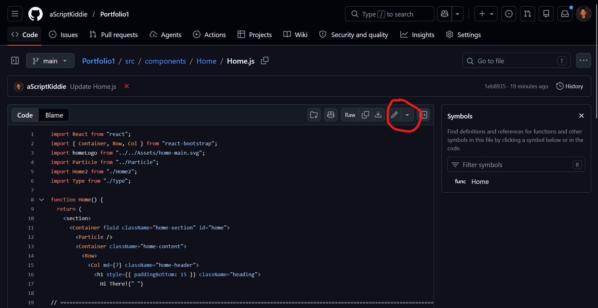

Hey There,
Before you begin, it is highly recommended that you customize this portfolio on a **laptop or medium-to-large screen device**.

---

🖥️ Setup Recommendation

For the smoothest experience, it is recommended that you have 2 browser tabs open side-by-side while customizing the portfolio.

🪟 Windows Users / 🐧 Linux Users

1. Open one tab for reading these instructions.
   
      Then press on your keyboard:
   
          Windows/Super Key + ← (left arrow key)  **Press both at the same time**
      
      This will show instructions to the left side of your screen.

2. Open a second tab for editing the code.
   
      Then press on your keyboard:
   
         Windows/Super Key + → (right arrow key)   **Press both at the same time**
            
      This will show instructions to the right side of your screen.

🍎 macOS Users

1. Open one tab for reading these instructions.

      Hover over the green fullscreen button at the top-left corner of the window.

      Then choose:

         Tile Window to Left of Screen
   
2. Open your second tab or code editor.

      Select:

         Tile Window to Right of Screen
   
      macOS will automatically place both windows side-by-side.

---

This portfolio was built to be easy to personalize, even if you’re a beginner. Don’t worry if some of this feels new at first, you only need to change a few lines to make the portfolio feel completely yours.

---

🏠 Home Page Customization

✨ Step 1: Open the Correct File

To customize the Home Page, locate this file inside the project:
      
          src/components/Home/Home.js
      
Yes, the file is called **Home.js**. This is where the main landing page text is edited.

Once you have the `Home.js`file open, click this editing icon on the screen,

---

✨ Step 2: Customizing the Greeting Wave

Inside `Home.js`, you will see a commented instruction between **line 19** and **line 21**.

It will ask you to choose a skin tone for the waving hand emoji.

Choose **ONLY ONE** of these:

      👋👋🏻👋🏼👋🏽👋🏾👋🏿

Please select **only one emoji**.

If multiple emojis are chosen, the code may not work correctly. Stay on the same file for step 3.

---

✨ Step 3: Changing Your Name

Next, look for another commented instruction in the same `Home.js` file between **line 31** and **line 32**.

You will see something like this on the Home Page:

      I'M [YOUR NAME]

Replace it with your real name, your nickname or anything you would like visitors to call you.

---

✨ Step 4: Saving The Edits

For you to save this 2 edits you have made locate the `Commit Changes` button like below circled in red.

   

If your prompted again, click the `Commit Changes` button again on the prompt.

You should see some changes on the portfolio.

---

✨ Step 5: Customizing Your Roles / Career Titles

Now we want to make visitors understand **what roles you can perform** or what roles you are currently seeking.

This could be roles such as:

* Help Desk
* SOC Analyst
* Security Analyst
* Web Developer
* Cloud Engineer
* Network Engineer

or anything else that matches your skills and goals.

We’re going to do the exact same thing we did before, but this time open this file:

      src/components/Home/Type.js

Yes, the file is called **Type.js**. This file controls the animated typing effect shown on the Home Page.

Click the exact same editing button we mentioned in Step 1.

Inside `Type.js`, look between approximately **line 10 and line 21**.

You will find a list of role title placeholders along with a commented instruction explaining what to edit.

---

✨ Step 6: Adding or Removing Roles

You can:

* Add as many roles as you want
* Remove any roles you don’t want
* Reorder them however you like

Just make sure you keep the **same formatting structure** when editing the list.

Make sure:

* Every role stays inside quotation marks `" "`
* Every line ends with a comma `,`

Once your done save the code using the instructions mentioned in Step 4.

---

✨ Step 7: Customizing Your Portfolio Brand Name

Now it’s time to give your portfolio its own identity by creating a **brand name**.

Think of this as the logo or title visitors will see in your navigation bar.

Choose something that best represents *you* and your personal brand.

Locate and open this file:

      src/components/Navbar.js

Yes, the file is called **Navbar.js**. This file controls the navigation bar displayed at the top of your portfolio.

Inside `Navbar.js`, go to **line 51**.

You will see some instructions to change the brand name from `[Name]` to your choosing.

---

✨ Step 8: Customizing Your Introduction Section

Now it’s time to introduce yourself properly to visitors viewing your portfolio.

If you scroll down on the Home Page, you will see a large block of text designed for you to talk about: Who you are, What you do, Your goals, Your interests, Your experience, Or anything else you want people to know about you.

This section helps make your portfolio feel more personal and professional.

Open the Home2.js File

Locate and open this file: 

      src/components/Home/Home2.js

Yes, the file is called **Home2.js**. This file controls the introduction/about-me section on the Home Page.

Inside `Home2.js`, go to **line 18**.

You will see instructions in the code to assist you with writing this section.

# 📌 Important Formatting Rules

## ✅ Keep The Same Indentation

      When editing the text, try to maintain the same spacing and structure already 
      used in the file.

## ✅ Creating Paragraph Spaces

      If you want to separate paragraphs, use:
       
       

## ✅ Making Words Purple

      To emphasize a word and make it purple, use:
      <b className="purple"> Your Word </b>

## ✅ Adding Italics

      To italicize a word, use:
      <i>Your Word</i>

## ⚠️ Important

      Please do **not** modify or delete any code underneath approximately **line 
      61** unless you understand what the code is doing.

